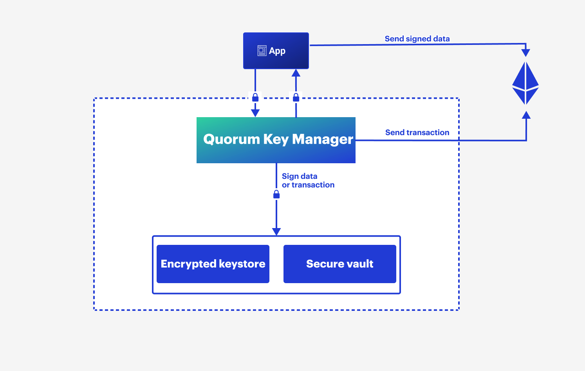

# Quorum Key Manager

## What is Quorum Key Manager?

Quorum Key Manager is an Ethereum account and key management service developed under the [BSL 1.1 license] and written
in Go.
Quorum Key Manager is a signing service that manages accounts and keys for the entire Quorum stack, and supports the
following vaults:

- HashiCorp Vault
- Azure Key Vault
- AWS Key Management Service
- PKCS #11 compatible HSMs

## Why use Quorum Key Manager?

Manage users' private keys from a single API while having keys stored in a secure vault, or V3 keystores.

Manage users' access rights using authentication and authorization, and audit the access history and signing requests
for registered keys.

Quorum Key Manager is compatible with GoQuorum, Hyperledger Besu, Codefi Orchestrate, and Tessera.

## Quorum Key Manager features

### Security

- Supports JWT or OpenID for authentication.
- Supports role-based access control (RBAC) over keys for authorization.
- Supports enterprise and cloud-based vaults.

### Versatility

- Supports public and private Ethereum networks.
- Supports signing transactions and [typed data].
- Supports signing using keys.

<!--links-->
[BSL 1.1 license]: https://mariadb.com/bsl11/
[typed data]: https://eips.ethereum.org/EIPS/eip-712
